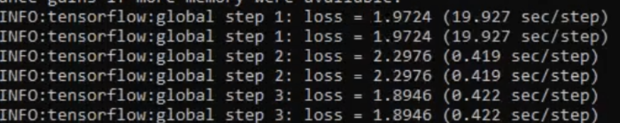

# UAV_Mauritia_Flexuosa_ML
This repository contains code that was used to develop a RCNN model with a custom dataset of Mauritia Flexuosa trees in Peru. The tensorflow object detection API was used, it can be found [here](https://github.com/tensorflow/models/tree/master/research/object_detection)


# TO RUN
- Download the model code [here](https://drive.google.com/file/d/1dUQ7oZ82xDZMewpBd4rheEeGKY1K-oj9/view?usp=sharing)
- Install the packages in the `requirements.txt` specifically `tensorflow 1.5`.
- Execute the `object_detection_test.ipynb` to run the pretrained model we created.


# TO BUILD YOUR OWN MODEL
- Download our model code [here](https://drive.google.com/file/d/1dUQ7oZ82xDZMewpBd4rheEeGKY1K-oj9/view?usp=sharing)


Packages and their corresponding versions to use when doing object_detection from the models/research/object_detection api


Make sure the following libraries are installed:
```
python -m pip install --user **Cython**
python -m pip install --user **contextlib2**
python -m pip install --user **pillow**
python -m pip install --user **lxml**
python -m pip install --user **jupyter**
python -m pip install --user **matplotlib**
```

Run the cocoapi installation process in the models/research folder (cloned above from github and saved somewhere locally.)
```
git clone https://github.com/cocodataset/cocoapi.git
cd cocoapi/PythonAPI
make
cp -r pycocotools <path_to_tensorflow>/models/research/
```


Download protobuf v3.4.0 from the website: 
https://github.com/protocolbuffers/protobuf/releases


Extract the downloaded folder in any directory. 


Then run the `use_protobuf.py` script with two inputs;
```
python use_protobuf.py <path to protos folder> <path to protoc file>  
Example: python use_protobuf.py object_detection/protos C:/Users/Gilbert/Downloads/bin/protoc 
```


`use_protobuf.py` is in the object_detection folder


The above protoc section should have converted the protoc files to python scripts.


Now we add the paths to our environment variables like so;
```
export PYTHONPATH=$PYTHONPATH:<full path to downloaded research folder>/models/research
export PYTHONPATH=$PYTHONPATH:/models/research/object_detection
export PYTHONPATH=$PYTHONPATH:/models/research/slim
```


Now you run;


**From within TensorFlow/models/research/**
```
python setup.py build
python setup.py install
```


Now test to see the installation process worked by running the object_detection_tutorial.ipynb notebook in the object_detection folder. If the images of dogs and other stuff are correctly classified then the installation process was a success. 


Now get your images for the model training process. And split these images into training and test. Store them in **object_detection/images/train** and **object_detection/images/test** 


To make the model more accurate and robust, create several hundred images of each class i.e. tree species do this for each class of tree image then also include the same amount of images of multiple tree species in the frame. 


I.e.
Train
- 80 dogs
- 80 cats
- 80 cats & dogs


You split the images by 80 percent in train folder and 20 percent in test


Test
- 20 dogs
- 20 cats
- 20 cats & dogs


We need to transform our images into low resolution as high resolution images would make the process very expensive computationally. 


We run the `transform_image_resolution.py` script like so;


**In the object_detection folder**
```
python transform_image_resolution.py -d images/ -s 800 600
```

We need to now label the data, we must download some labelling software to do this. Download labelImg at; [labelImg](tzutalin.github.io/labelImg/)


Now launch the software. Then click Open Dir to open the /images/train or /images/test folders. This should load up all the images in each folder. 


Now change the Save Dir to the same folder as well. Say you’re starting with the train images then you set Save Dir to the train images. This will make sure the .xml labels produced are saved in their specific folders. 


1) Now click on the **“Create RectBox”** button and draw a rectangle over the image you want to label. Then click save then click Next Image


**REPEAT PROCESS 1 TILL YOU REACH THE LAST IMAGE** 


Now repeat 1 with the next folder so in our case it would be **/images/test**.


Once the process is finished. Have a look in the **/images/train** and **/images/test** folders to see if each image has a .xml file corresponding to it. 


**If so continue, if not then go through the LabelImg step again.** 


Now we want to run the xml_to_csv.py script which will create two **.csv** files with the information for each image stored in each folder. There will be **train_labels.csv** and **test_labels.csv** folders present if the script runs successfully. This script requires that the images are all labelled. It then reads these **.xml** files and populates a table row by row for each image. 


Now check in the /object_detection/images/ folder to see if train_labels.csv and test_labels.csv have been produced. Also check if they are populated with the data from the .xml labels. 


Now we want to create the tensorflow record files. Using the generate_tfrecords.py script, replace the def **class_text_to_int(row_label)** method with the names of classes we are training for i.e.
```
    if row_label == 'dog':
        return 1
    elif row_label == 'cat':
        return 2
    elif row_label == 'mix':
        return 3
    else: 
		return None
```


Save the script in the object_detection folder and run it using the bash command; 
```
python generate_tfrecord.py --csv_input=images\train_labels.csv --image_dir=images\train —output_path=train.record

python generate_tfrecord.py --csv_input=images\test_labels.csv --image_dir=images\test —output_path=test.record
```


Once these two bash commands have run, we should have train.record and test.record files in the object_detection folder. 


Now create a folder called training in the object_detection folder. So **/object_detection/training/**


Inside this training folder. Create a **labelmap.pbtxt** file using a text editor and inside add each class like so;
```
item {
    id: 1
    name: 'dog'
}
item {
    id: 2
    name: 'cat'
}
item {
    id: 3
    name: 'mix'
}
```


Save this. 

Now we need to create a training configuration. We will be using the faster_rcnn_inception model so download it from [here](https://github.com/tensorflow/models/blob/master/research/object_detection/g3doc/detection_model_zoo.md) 


The model to download is: **faster_rcnn_inception_v2_coco**


Save the **faster_rcnn_inception_v2_coco_2018_01_28** to the object_detection folder. 

Copy the **faster_rcnn_inception_v2_pets.config** in the **/object_detection/samples/configs/** folder and place it in the **/training/** folder. Now edit this .config file in a text editor replacing the following lines; 


- Change line 9 to the number of classes we have, in our case it’s 3

- Change line 106 fine_tune_checkpoints to fine_tune_checkpoint: “/models/research/object_detection/faster_rcnn_inception_v2_coco_2018_01_28/model.ckpt”

- Change line 123 input_path to the path of the train.records file: input_path: "/models/research/object_detection/train.record"
 
- Change line 135 input_path to the path of the test.records file: input_path: “/models/research/object_detection/test.record"

- Changes lines 125 and 137 the label_map path to the training/labelmap.pbtxt location; label_map_path: “/models/research/object_detection/training/labelmap.pbtxt"

- Change line 130: num_example to the number of images in the test folder. In our case; num_example = 60.


**Now we will train our model.** 

Take the **train.py** script from the **/object_detection/legacy/** folder and place it in the object_detection folder. 

To train the model, you then run the following command from the object_detection folder; 
```
python train.py --logtostderr -—train_dir=training/ —-pipeline_config_path=training/faster_rcnn_inception_v2_pets.config
```


If everything is set up correctly, i.e. the path variables and version of tensorflow for python 2.7 the model should soon start training, and in the terminal it should look like this:



You allow the model to run longer if you have more data. I recommend letting the model run for roughly an hour and a half. Make sure that the loss= score goes down. We want it as close as possible to 0.

Once you are done training the model. Hit **Ctrl + Z** (Unix bash) to end the training process. 

Check the **/object_detection/training/** folder to see if a model.ckpt has been generated. This checkpoint file should have several digits in its name i.e. Mine had: model.ckpt-461.index the number 461 is the highest number of seconds spent during training. So note this number down for the next stage. 


Now we need to generate the inference graph we run the bash command below in the /object_detection/ folder this should execute the **export_inference_graph.py** script;
```
python export_inference_graph.py --input_type image_tensor --pipeline_config_path training/faster_rcnn_inception_v2_pets.config --trained_checkpoint_prefix training/model.ckpt-XXXX --output_directory inference_graph
```


Replace the **XXXX** with the number from **model.ckpt** in my case it’s 461. So it should be;
```
python export_inference_graph.py --input_type image_tensor --pipeline_config_path training/faster_rcnn_inception_v2_pets.config --trained_checkpoint_prefix training/model.ckpt-461 --output_directory inference_graph
```


Execute this command and it should take a few seconds to run. Once it finishes running, we should be able to see an inference_graph folder in object_detection 


Now we can run our model using the **object_detection_test.ipynb** notebook. In cell 4 change the lines to;
```
MODEL_NAME = 'inference_graph'
PATH_TO_FROZEN_GRAPH = MODEL_NAME + '/frozen_inference_graph.pb'
PATH_TO_LABELS = ‘training/labelmap.pbtxt'
```


As we are running the jupyter notebook file in the /object_detection folder. We name our model inference_graph. We set the path to the labelmap which is within /training/ folder. 


Now we can run the script and it should present a live webcam view. Put an object you are trying to detect I.e. in our case a cat or dog and it should tell is what it is and where in the view it is.
